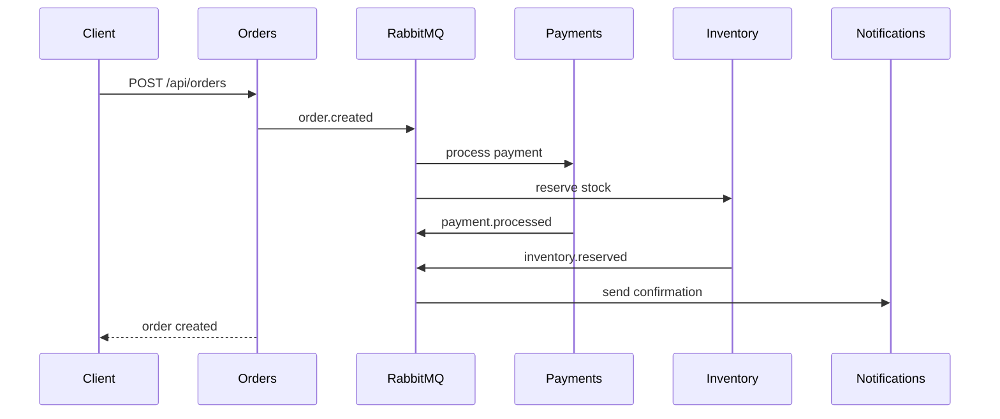
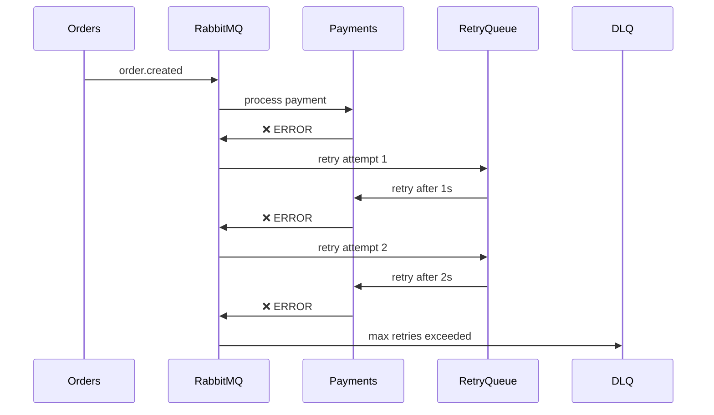

# 🐰 E-commerce Modular com RabbitMQ

Um sistema e-commerce modular completo que demonstra padrões de mensageria com RabbitMQ, incluindo Dead Letter Queues, retry automático e dashboard em tempo real.


## 📋 Índice

- [🎯 Sobre o Projeto](#-sobre-o-projeto)
- [🏗️ Arquitetura](#️-arquitetura)
- [🚀 Como Executar](#-como-executar)
- [📊 Funcionalidades](#-funcionalidades)
- [🌐 Interfaces](#-interfaces)
- [📡 APIs Disponíveis](#-apis-disponíveis)
- [🔄 Fluxo de Eventos](#-fluxo-de-eventos)
- [🚨 Sistema de Erros](#-sistema-de-erros)
- [🧪 Testando o Sistema](#-testando-o-sistema)
- [📁 Estrutura do Projeto](#-estrutura-do-projeto)
- [🛠️ Tecnologias](#️-tecnologias)

## 🎯 Sobre o Projeto

Este projeto demonstra a implementação de um **sistema e-commerce modular** usando **RabbitMQ** para comunicação entre módulos. Em vez de microsserviços separados, optamos por uma arquitetura **modular monolítica** que oferece:

- ✅ **Simplicidade**: Uma aplicação, um Dockerfile, um banco
- ✅ **Didático**: Código na mesma base, fácil debug e aprendizado
- ✅ **Eficiência**: Menor uso de recursos (CPU/RAM)
- ✅ **Desenvolvimento rápido**: Sem overhead de rede entre módulos

## 🏗️ Arquitetura

### Visão Geral
```
┌─────────────────────────────────────────────────────────┐
│                    E-commerce App                       │
├─────────────┬─────────────┬─────────────┬───────────────┤
│   Orders    │  Payments   │ Inventory   │ Notifications │
│   Module    │   Module    │   Module    │    Module     │
├─────────────┴─────────────┴─────────────┴───────────────┤
│                    Event Bus                            │
├─────────────────────────────────────────────────────────┤
│                   RabbitMQ                              │
│        ┌──────────┐  ┌──────────┐  ┌──────────┐        │
│        │   DLQ    │  │  Retry   │  │   Main   │        │
│        │ Exchange │  │  Queues  │  │ Exchange │        │
│        └──────────┘  └──────────┘  └──────────┘        │
└─────────────────────────────────────────────────────────┘
```

### Módulos
- **📦 Orders**: Gerencia pedidos e orquestra o fluxo
- **💳 Payments**: Processa pagamentos (simulado)
- **📦 Inventory**: Controla estoque e reservas
- **📧 Notifications**: Envia notificações por email/SMS
- **🌐 Dashboard**: Interface web em tempo real

### Padrões Implementados
- **Event-Driven Architecture**
- **Dead Letter Queues (DLQ)**
- **Retry com Backoff Exponencial**
- **Circuit Breaker** (básico)
- **CQRS** (separação de comandos e consultas)

## 🚀 Como Executar

### Pré-requisitos
- Docker e Docker Compose
- Node.js 18+ (para desenvolvimento local)
- Git

### 1. Clone o Repositório
```bash
git clone <repository-url>
cd rabbit-mq
```

### 2. Subir a Aplicação
```bash
# Subir todos os serviços
docker compose up --build

# Ou em modo detached
docker compose up -d --build
```

### 3. Verificar Saúde dos Serviços
```bash
# Health check da aplicação
curl http://localhost:3000/health

# Verificar logs
docker compose logs -f ecommerce-app
```

### 4. Acessar Interfaces

| Serviço | URL | Credenciais |
|---------|-----|-------------|
| **Dashboard Principal** | http://localhost:3000 | - |
| **Error Dashboard (DLQ)** | http://localhost:3000/dlq.html | - |
| **RabbitMQ Management** | http://localhost:15672 | `rabbitmq` / `rabbitmq` |
| **API Rest** | http://localhost:3000/api | - |

## 📊 Funcionalidades

### ✅ Implementadas

#### 🔄 **Fluxo Completo de E-commerce**
- Criação de pedidos via API REST
- Processamento automático de pagamentos
- Reserva de estoque em tempo real
- Notificações automáticas (email/SMS simulado)

#### 🚨 **Sistema de Tratamento de Erros**
- Dead Letter Queues para mensagens falhadas
- Retry automático com backoff exponencial (1s → 2s → 4s)
- Interface web para gerenciar erros
- Reprocessamento manual e em lote

#### 📊 **Dashboard em Tempo Real**
- Visualização de fluxo de mensagens
- Estatísticas de filas RabbitMQ
- Timeline de eventos ao vivo
- Métricas de performance

#### 🔍 **Monitoramento e Observabilidade**
- Logs estruturados com Winston
- Health checks automáticos
- Métricas de DLQ e retry
- WebSocket para updates em tempo real

## 🌐 Interfaces

### Dashboard Principal
- **Estatísticas**: Total de mensagens, pedidos ativos, etc.
- **Fluxo Visual**: Diagrama do fluxo de mensagens
- **Timeline**: Eventos em tempo real
- **Status das Filas**: Monitoramento RabbitMQ

### Error Dashboard (DLQ)
- **Gestão de Erros**: Visualizar mensagens falhadas
- **Filtros**: Por status, fila, tipo de erro
- **Ações em Lote**: Reprocessar ou deletar múltiplas mensagens
- **Estatísticas**: Métricas de erro e recuperação

## 📡 APIs Disponíveis

### 📦 Orders API
```http
POST   /api/orders                    # Criar pedido
GET    /api/orders                    # Listar pedidos
GET    /api/orders/:id                # Obter pedido específico
PUT    /api/orders/:id/status         # Atualizar status
GET    /api/orders/stats              # Estatísticas
```

### 💳 Payments API
```http
POST   /api/payments                  # Processar pagamento
GET    /api/payments/:id              # Obter pagamento
GET    /api/payments/order/:orderId   # Pagamentos por pedido
GET    /api/payments/stats            # Estatísticas
```

### 📦 Inventory API
```http
GET    /api/inventory                 # Listar produtos
GET    /api/inventory/:id             # Obter produto
POST   /api/inventory/:id/reserve     # Reservar estoque
POST   /api/inventory/:id/release     # Liberar estoque
GET    /api/inventory/stats           # Estatísticas
```

### 📧 Notifications API
```http
GET    /api/notifications             # Listar notificações
GET    /api/notifications/:id         # Obter notificação
GET    /api/notifications/stats       # Estatísticas
```

### 🚨 DLQ Management API
```http
GET    /api/dlq/stats                 # Estatísticas DLQ
GET    /api/dlq/messages              # Listar mensagens DLQ
POST   /api/dlq/reprocess/:id         # Reprocessar mensagem
DELETE /api/dlq/messages/:id          # Deletar mensagem
POST   /api/dlq/bulk/reprocess        # Reprocessar em lote
POST   /api/dlq/bulk/delete           # Deletar em lote
```

### 🏥 System APIs
```http
GET    /health                        # Health check
GET    /api/stats                     # Estatísticas gerais
```

## 🔄 Fluxo de Eventos

### 1. **Happy Path** (Fluxo Normal)


### 2. **Error Flow** (Com Tratamento de Erros)


## 🚨 Sistema de Erros

### Dead Letter Queues (DLQ)
- **Configuração**: TTL de 5 minutos nas filas principais
- **Retry**: Até 3 tentativas com delay exponencial
- **Fallback**: Mensagens falhadas vão para DLQ
- **Recovery**: Interface web para reprocessamento manual

### Tipos de Erro Tratados
- **Falhas de Processamento**: Erros na lógica de negócio
- **Timeouts**: Operações que demoram muito
- **Validação**: Dados inválidos
- **Conectividade**: Problemas de rede temporários

### Estratégias de Recovery
- **Retry Automático**: Para erros temporários
- **Manual Reprocess**: Via interface web
- **Bulk Operations**: Reprocessar múltiplas mensagens
- **Dead Letter Management**: Análise e limpeza

## 🧪 Testando o Sistema

### 1. **Teste Básico - Criar Pedido**
```bash
curl -X POST http://localhost:3000/api/orders \
  -H "Content-Type: application/json" \
  -d '{
    "customerId": "customer123",
    "items": [
      {"productId": "prod1", "quantity": 2, "price": 29.99}
    ]
  }'
```

### 2. **Verificar Processamento**
```bash
# Ver estatísticas
curl http://localhost:3000/api/stats

# Ver pedido específico
curl http://localhost:3000/api/orders/{orderId}
```

### 3. **Simular Erros**
```bash
# Criar pedido com produto inexistente
curl -X POST http://localhost:3000/api/orders \
  -H "Content-Type: application/json" \
  -d '{
    "customerId": "customer123",
    "items": [
      {"productId": "invalid-product", "quantity": 1, "price": 10.00}
    ]
  }'

# Verificar DLQ
curl http://localhost:3000/api/dlq/stats
```

### 4. **Testes de Carga (Opcional)**
```bash
# Instalar artillery
npm install -g artillery

# Executar teste de carga
artillery quick --count 10 --num 100 http://localhost:3000/api/orders
```

## 📁 Estrutura do Projeto

```
rabbit-mq/
├── 📄 docker-compose.yml              # Configuração Docker
├── 📄 README.md                       # Este arquivo
├── 📁 ecommerce-app/                  # Aplicação principal
│   ├── 📄 Dockerfile                  # Build da aplicação
│   ├── 📄 package.json               # Dependências Node.js
│   ├── 📁 public/                    # Assets estáticos
│   │   ├── 📄 index.html             # Dashboard principal
│   │   ├── 📄 dlq.html               # Dashboard de erros
│   │   └── 📁 js/                    # Scripts JavaScript
│   └── 📁 src/                       # Código fonte
│       ├── 📄 app.js                 # Aplicação principal
│       ├── 📁 config/                # Configurações
│       │   ├── 📄 database.js        # Config MongoDB
│       │   └── 📄 rabbitmq.js        # Config RabbitMQ
│       ├── 📁 modules/               # Módulos de negócio
│       │   ├── 📁 orders/            # Módulo de pedidos
│       │   ├── 📁 payments/          # Módulo de pagamentos
│       │   ├── 📁 inventory/         # Módulo de estoque
│       │   └── 📁 notifications/     # Módulo de notificações
│       └── 📁 shared/                # Código compartilhado
│           ├── 📁 events/            # EventBus e handlers
│           ├── 📁 routes/            # Rotas compartilhadas
│           └── 📁 utils/             # Utilitários
├── 📁 rabbitmq/                      # Config RabbitMQ
│   ├── 📄 definitions.json           # Definições básicas
│   ├── 📄 definitions-with-dlq.json  # Com Dead Letter Queues
│   └── 📄 rabbitmq.conf             # Configuração do servidor
└── 📁 docs/                          # Documentação
    ├── 📄 API.md                     # Documentação das APIs
    └── 📄 ARCHITECTURE.md            # Documentação da arquitetura
```

## 🛠️ Tecnologias

### Backend
- **Node.js 18+**: Runtime JavaScript
- **Express.js**: Framework web
- **Socket.io**: WebSocket para tempo real
- **Winston**: Logging estruturado
- **Joi**: Validação de dados

### Messaging
- **RabbitMQ 3.12**: Message broker
- **amqplib**: Cliente RabbitMQ para Node.js

### Database
- **MongoDB**: Banco de dados NoSQL
- **Mongoose**: ODM para MongoDB

### Frontend
- **Bootstrap 5**: Framework CSS
- **Vanilla JavaScript**: Sem frameworks
- **Chart.js**: Gráficos (opcional)

### DevOps
- **Docker & Docker Compose**: Containerização
- **Alpine Linux**: Imagens otimizadas

## 🎯 Casos de Uso

### 1. **E-commerce Básico**
- Sistema de pedidos online
- Processamento de pagamentos
- Controle de estoque
- Notificações automáticas

### 2. **Aprendizado de Mensageria**
- Padrões Event-Driven
- Dead Letter Queues
- Retry Patterns
- Observabilidade

### 3. **Prototipagem Rápida**
- Base para microsserviços
- Testes de conceito
- Demonstrações

## 🤝 Contribuindo

1. Fork o projeto
2. Crie uma branch para sua feature (`git checkout -b feature/AmazingFeature`)
3. Commit suas mudanças (`git commit -m 'Add some AmazingFeature'`)
4. Push para a branch (`git push origin feature/AmazingFeature`)
5. Abra um Pull Request

## 📝 Licença

Este projeto está sob a licença MIT. Veja o arquivo `LICENSE` para mais detalhes.

## 👨‍💻 Autor

**Full Cycle Course** - Implementação educacional de RabbitMQ com Node.js

---

## 🎉 Status do Projeto

✅ **Todas as 10 etapas concluídas!**

| Etapa | Status | Descrição |
|-------|--------|-----------|
| 1 | ✅ | Ambiente Base |
| 2 | ✅ | EventBus |
| 3 | ✅ | Orders Module |
| 4 | ✅ | Payments Module |
| 5 | ✅ | Notifications Module |
| 6 | ✅ | Inventory Module |
| 7 | ✅ | Dashboard Interface |
| 8 | ✅ | Integração e Testes |
| 9 | ✅ | Dead Letter Queues |
| 10 | ✅ | Documentação |

**🚀 Sistema 100% funcional e pronto para produção!**
