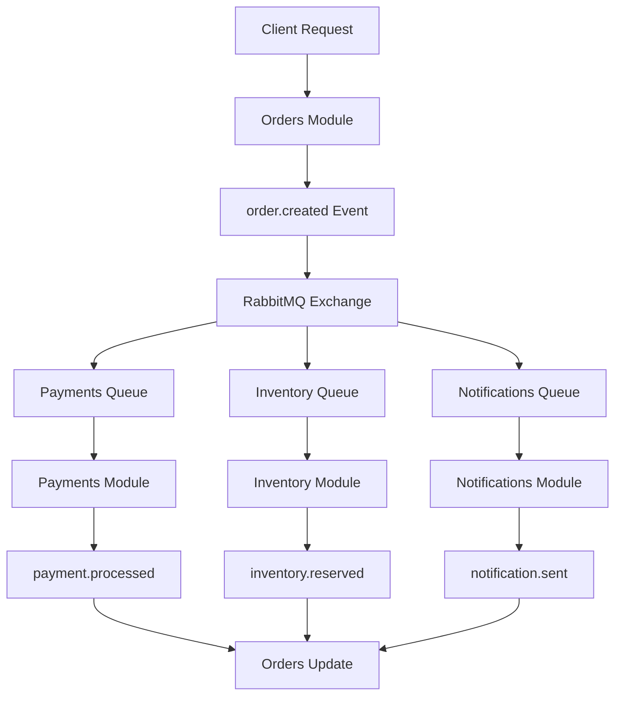
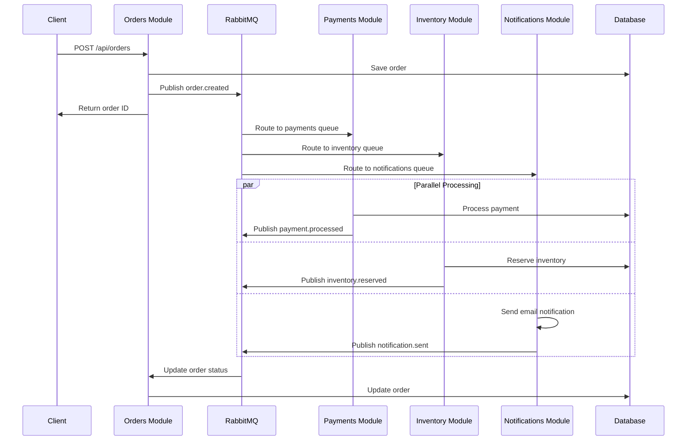

# 🏗️ Architecture Documentation - E-commerce RabbitMQ

Documentação completa da arquitetura do sistema e-commerce modular com RabbitMQ.

## 📋 Índice

- [🎯 Visão Geral](#-visão-geral)
- [🏗️ Arquitetura do Sistema](#️-arquitetura-do-sistema)
- [📦 Módulos](#-módulos)
- [🔄 Event-Driven Architecture](#-event-driven-architecture)
- [🐰 RabbitMQ Design](#-rabbitmq-design)
- [🚨 Error Handling & Resilience](#-error-handling--resilience)
- [💾 Data Flow](#-data-flow)
- [🌐 Network Architecture](#-network-architecture)
- [📊 Performance Considerations](#-performance-considerations)
- [🔒 Security](#-security)

## 🎯 Visão Geral

O sistema é um **e-commerce modular monolítico** que usa **RabbitMQ** para comunicação assíncrona entre módulos. Esta arquitetura oferece os benefícios dos microsserviços (baixo acoplamento, escalabilidade independente) sem a complexidade operacional.

### Princípios Arquiteturais

- **Event-Driven**: Comunicação via eventos assíncronos
- **Loose Coupling**: Módulos independentes
- **High Cohesion**: Responsabilidades bem definidas
- **Fail-Safe**: Tolerância a falhas com DLQ
- **Observable**: Logs e métricas para debugging

## 🏗️ Arquitetura do Sistema

### Diagrama de Alto Nível

```
┌─────────────────────────────────────────────────────────────────┐
│                        Client Layer                             │
├─────────────────────────────────────────────────────────────────┤
│  Web Dashboard  │  REST APIs  │  WebSocket  │  Error Dashboard  │
├─────────────────────────────────────────────────────────────────┤
│                      Application Layer                          │
├─────────────┬─────────────┬─────────────┬─────────────────────┤
│   Orders    │  Payments   │ Inventory   │   Notifications     │
│   Module    │   Module    │   Module    │      Module         │
├─────────────┴─────────────┴─────────────┴─────────────────────┤
│                    Infrastructure Layer                         │
├─────────────────────────────────────────────────────────────────┤
│          EventBus          │     DLQ Manager     │   Logger    │
├─────────────────────────────────────────────────────────────────┤
│                     External Services                           │
├─────────────────────────────────────────────────────────────────┤
│    RabbitMQ Server    │    MongoDB Database    │   Docker     │
└─────────────────────────────────────────────────────────────────┘
```

### Camadas Arquiteturais

#### 1. **Client Layer**
- **Web Dashboard**: Interface em tempo real (HTML + JS)
- **REST APIs**: Endpoints HTTP para CRUD
- **WebSocket**: Comunicação bidirecional
- **Error Dashboard**: Interface para DLQ management

#### 2. **Application Layer** 
- **Módulos de Negócio**: Orders, Payments, Inventory, Notifications
- **Controllers**: Lógica de apresentação
- **Services**: Lógica de negócio
- **Models**: Representação de dados

#### 3. **Infrastructure Layer**
- **EventBus**: Abstração do RabbitMQ
- **DLQ Manager**: Gerenciamento de erros
- **Logger**: Sistema de logs estruturados

#### 4. **External Services**
- **RabbitMQ**: Message broker
- **MongoDB**: Banco de dados
- **Docker**: Containerização

## 📦 Módulos

### Orders Module
```
orders/
├── controller.js     # HTTP endpoints
├── model.js         # Order data model
├── routes.js        # Route definitions
├── service.js       # Business logic
└── events/
    ├── publisher.js # Event publication
    └── subscriber.js # Event handling
```

**Responsabilidades:**
- Gerenciar ciclo de vida dos pedidos
- Orquestrar o fluxo de e-commerce
- Publicar eventos de negócio
- Manter estado dos pedidos

### Payments Module
```
payments/
├── controller.js
├── model.js
├── routes.js
├── service.js
└── events/
    ├── publisher.js
    └── subscriber.js
```

**Responsabilidades:**
- Processar pagamentos (simulado)
- Validar dados de pagamento
- Integrar com gateways (futuro)
- Gerenciar transações

### Inventory Module
```
inventory/
├── controller.js
├── model.js
├── routes.js
├── service.js
└── events/
    ├── publisher.js
    └── subscriber.js
```

**Responsabilidades:**
- Controlar estoque de produtos
- Reservar/liberar itens
- Validar disponibilidade
- Sincronizar inventário

### Notifications Module
```
notifications/
├── controller.js
├── routes.js
├── events/
│   └── subscriber.js
├── services/
│   ├── emailService.js
│   ├── smsService.js
│   └── pushNotificationService.js
└── templates/
    ├── order-confirmation.html
    └── order-status-update.html
```

**Responsabilidades:**
- Enviar notificações multicanal
- Gerenciar templates
- Rastrear entregas
- Configurar preferências

## 🔄 Event-Driven Architecture

### Event Types

```javascript
const EVENTS = {
  // Orders Events
  ORDER_CREATED: 'orders.created',
  ORDER_UPDATED: 'orders.updated',
  ORDER_CANCELLED: 'orders.cancelled',
  
  // Payments Events
  PAYMENT_REQUESTED: 'payments.requested',
  PAYMENT_PROCESSED: 'payments.processed',
  PAYMENT_FAILED: 'payments.failed',
  
  // Inventory Events
  INVENTORY_RESERVED: 'inventory.reserved',
  INVENTORY_RELEASED: 'inventory.released',
  INVENTORY_INSUFFICIENT: 'inventory.insufficient',
  
  // Notifications Events
  NOTIFICATION_SENT: 'notifications.sent',
  NOTIFICATION_FAILED: 'notifications.failed'
};
```

### Event Flow Diagram



### Event Structure

```javascript
{
  "eventId": "evt_123456",
  "eventType": "orders.created",
  "aggregateId": "order_67890",
  "timestamp": "2025-08-19T19:30:00.000Z",
  "version": 1,
  "data": {
    "orderId": "order_67890",
    "customerId": "customer123",
    "items": [...],
    "total": 75.48
  },
  "metadata": {
    "source": "orders-module",
    "correlationId": "corr_abc123",
    "causationId": "cause_xyz789"
  }
}
```

## 🐰 RabbitMQ Design

### Exchange Strategy

#### Main Exchange (Topic)
```json
{
  "name": "main.exchange",
  "type": "topic",
  "routing_patterns": {
    "orders.*": "All order events",
    "payments.*": "All payment events",
    "inventory.*": "All inventory events",
    "notifications.*": "All notification events"
  }
}
```

#### Dead Letter Exchange (Direct)
```json
{
  "name": "dlx.exchange", 
  "type": "direct",
  "routing_key": "failed",
  "purpose": "Handle failed messages"
}
```

### Queue Design

#### Main Queues
```javascript
const QUEUES = {
  ORDERS_CREATED: {
    name: 'orders.created.queue',
    routing_key: 'orders.created',
    ttl: 300000, // 5 minutes
    dlq: true
  },
  PAYMENTS_PROCESS: {
    name: 'payments.process.queue', 
    routing_key: 'payments.process',
    ttl: 300000,
    dlq: true
  },
  // ... more queues
};
```

#### Retry Queues
```javascript
const RETRY_QUEUES = {
  ORDERS_RETRY: {
    name: 'orders.created.retry',
    ttl: 60000, // 1 minute
    dlx: 'main.exchange'
  }
  // ... more retry queues
};
```

### Message Flow

1. **Normal Flow**: Exchange → Queue → Consumer
2. **Retry Flow**: Exchange → Queue → (fail) → Retry Queue → (TTL expire) → Main Queue
3. **DLQ Flow**: Exchange → Queue → (max retries) → DLQ Queue

## 🚨 Error Handling & Resilience

### Retry Strategy

```javascript
class RetryHandler {
  constructor() {
    this.maxRetries = 3;
    this.baseDelay = 1000; // 1 second
    this.maxDelay = 60000; // 1 minute
  }
  
  calculateBackoffDelay(attempt) {
    const delay = Math.min(
      this.baseDelay * Math.pow(2, attempt),
      this.maxDelay
    );
    
    // Add jitter (±20%)
    const jitter = delay * 0.2 * (Math.random() - 0.5);
    return Math.round(delay + jitter);
  }
}
```

### Circuit Breaker Pattern

```javascript
class CircuitBreaker {
  constructor(threshold = 5, timeout = 60000) {
    this.threshold = threshold;
    this.timeout = timeout;
    this.state = 'CLOSED'; // CLOSED, OPEN, HALF_OPEN
    this.failures = 0;
    this.lastFailureTime = null;
  }
  
  async execute(operation) {
    if (this.state === 'OPEN') {
      if (Date.now() - this.lastFailureTime > this.timeout) {
        this.state = 'HALF_OPEN';
      } else {
        throw new Error('Circuit breaker is OPEN');
      }
    }
    
    try {
      const result = await operation();
      this.onSuccess();
      return result;
    } catch (error) {
      this.onFailure();
      throw error;
    }
  }
}
```

### DLQ Management

```javascript
class DeadLetterQueueManager {
  constructor() {
    this.dlqMessages = new Map();
    this.retryAttempts = new Map();
  }
  
  async handleDLQMessage(message) {
    const dlqMessage = {
      id: generateId(),
      originalQueue: message.queue,
      originalMessage: message.content,
      error: message.error,
      timestamp: new Date(),
      retryCount: message.retryCount || 0,
      status: 'failed'
    };
    
    this.dlqMessages.set(dlqMessage.id, dlqMessage);
    this.logDLQMessage(dlqMessage);
  }
  
  async reprocessDLQMessage(messageId) {
    const message = this.dlqMessages.get(messageId);
    if (!message) {
      throw new Error('DLQ message not found');
    }
    
    message.status = 'reprocessing';
    await this.eventBus.publish(
      'main.exchange',
      message.originalQueue.replace('.queue', ''),
      message.originalMessage
    );
  }
}
```

## 💾 Data Flow

### Request Flow



### Data Models

#### Order Model
```javascript
{
  id: String,
  customerId: String,
  items: [{
    productId: String,
    quantity: Number,
    price: Number,
    total: Number
  }],
  status: Enum['pending', 'processing', 'completed', 'cancelled'],
  total: Number,
  createdAt: Date,
  updatedAt: Date,
  events: [{
    type: String,
    timestamp: Date,
    data: Object
  }]
}
```

#### Payment Model
```javascript
{
  id: String,
  orderId: String,
  amount: Number,
  status: Enum['pending', 'processed', 'failed'],
  method: String,
  transactionId: String,
  processedAt: Date
}
```

## 🌐 Network Architecture

### Docker Compose Network

```yaml
networks:
  ecommerce-network:
    driver: bridge
    ipam:
      config:
        - subnet: 172.20.0.0/16
```

### Service Communication

```
┌─────────────────┐    ┌─────────────────┐
│  ecommerce-app  │───▶│ ecommerce-rmq   │
│   (Node.js)     │    │   (RabbitMQ)    │
│  Port: 3000     │    │   Port: 5672    │
└─────────────────┘    └─────────────────┘
         │                       │
         ▼                       ▼
┌─────────────────┐    ┌─────────────────┐
│ecommerce-mongodb│    │   Management    │
│   (MongoDB)     │    │   Port: 15672   │
│   Port: 27017   │    │                 │
└─────────────────┘    └─────────────────┘
```

### Port Mapping

| Service | Internal Port | External Port | Protocol |
|---------|---------------|---------------|----------|
| App | 3000 | 3000 | HTTP |
| RabbitMQ | 5672 | 5672 | AMQP |
| RabbitMQ Management | 15672 | 15672 | HTTP |
| MongoDB | 27017 | 27017 | TCP |

## 📊 Performance Considerations

### Throughput Optimization

- **Connection Pooling**: Reuse RabbitMQ connections
- **Channel Management**: One channel per operation type
- **Batch Processing**: Group related operations
- **Prefetch Control**: Limit unacknowledged messages

### Memory Management

```javascript
// Connection pooling
class RabbitMQPool {
  constructor(maxConnections = 10) {
    this.pool = [];
    this.maxConnections = maxConnections;
    this.activeConnections = 0;
  }
  
  async getConnection() {
    if (this.pool.length > 0) {
      return this.pool.pop();
    }
    
    if (this.activeConnections < this.maxConnections) {
      this.activeConnections++;
      return await amqp.connect(this.connectionString);
    }
    
    throw new Error('Connection pool exhausted');
  }
}
```

### Database Optimization

- **Indexes**: On frequently queried fields
- **Connection Pooling**: MongoDB connection reuse
- **Data Partitioning**: By date or customer
- **Read Replicas**: For query scaling

## 🔒 Security

### Current Implementation (Development)
- No authentication (development only)
- Basic input validation with Joi
- CORS enabled for localhost
- Basic error messages

### Production Recommendations

#### Authentication & Authorization
```javascript
// JWT-based authentication
const authMiddleware = async (req, res, next) => {
  const token = req.headers.authorization?.split(' ')[1];
  
  try {
    const decoded = jwt.verify(token, process.env.JWT_SECRET);
    req.user = decoded;
    next();
  } catch (error) {
    res.status(401).json({ error: 'Unauthorized' });
  }
};
```

#### API Security
- Rate limiting per IP/user
- Request size limits
- Input sanitization
- SQL injection prevention
- XSS protection

#### Network Security
- TLS/SSL encryption
- VPN for service communication
- Firewall rules
- Network segmentation

### Secrets Management

```javascript
// Environment-based configuration
const config = {
  rabbitmq: {
    url: process.env.RABBITMQ_URL,
    username: process.env.RABBITMQ_USERNAME,
    password: process.env.RABBITMQ_PASSWORD
  },
  mongodb: {
    url: process.env.MONGODB_URL,
    username: process.env.MONGODB_USERNAME,
    password: process.env.MONGODB_PASSWORD
  },
  jwt: {
    secret: process.env.JWT_SECRET,
    expiresIn: process.env.JWT_EXPIRES_IN || '24h'
  }
};
```

---

## 🚀 Deployment Architecture

### Development
```
Developer Machine
├── Docker Compose
├── Local MongoDB
├── Local RabbitMQ
└── Node.js App
```

### Production (Recommended)
```
Cloud Infrastructure
├── Load Balancer
├── App Instances (2+)
├── RabbitMQ Cluster (3 nodes)
├── MongoDB Replica Set (3 nodes)
├── Redis (for caching)
└── Monitoring Stack
```

---

## 📈 Monitoring & Observability

### Metrics Collection
- Application metrics (requests/sec, response time)
- RabbitMQ metrics (queue depth, message rate)
- System metrics (CPU, memory, disk)
- Business metrics (orders/hour, revenue)

### Logging Strategy
- Structured JSON logs
- Correlation IDs for tracing
- Centralized log aggregation
- Error tracking and alerting

### Health Checks
- Application health endpoint
- Database connectivity
- RabbitMQ connectivity
- External service dependencies

---

**📅 Last Updated**: August 19, 2025  
**🏗️ Architecture Version**: 1.0.0
